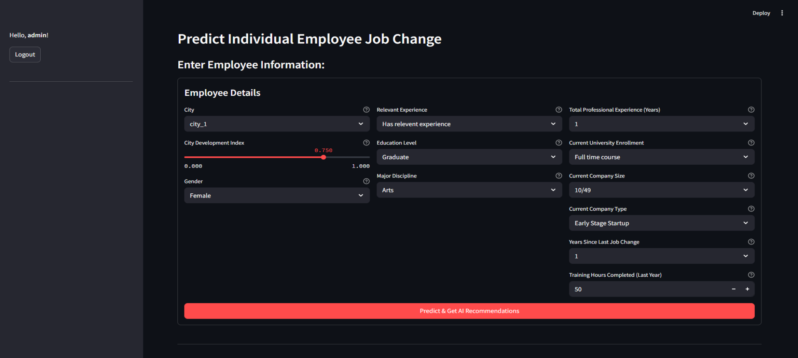

# HR Analytics: Job Change Prediction for Data Scientists



Predict employee retention risks and get AI-powered recommendations for data science professionals.

## Features
- 🧠 Machine learning-powered attrition prediction
- 🤖 GPT-2 powered retention recommendations
- 🔐 Role-based authentication
- 📊 Interactive employee profile analysis
- 📈 Probability confidence scores

## Installation
```bash
# Clone repository
git clone https://github.com/HR-Analytics-DS.git
cd HR-Analytics-DS

# Install dependencies
# For model training environment
pip install -r training/requirements.txt

# For Streamlit application
pip install -r app/requirements.txt

# Run Streamlit app
streamlit run app/streamlit_app.py
```

## Usage
1. Login with demo credentials:
   - Admin: `admin` / `secret123`
   - User: `user` / `secret123`
2. Fill in employee details
3. Get retention prediction
4. Review AI-powered recommendations

## Project Structure
```
hr-analytics-job-change/
├── app/              # Streamlit application
├── training/         # Model training scripts
├── models/           # Trained models
├── data/             # Sample datasets
├── docs/             # Documentation
└── tests/            # Test cases
```

## Model Performance
| Metric | Value |
|--------|-------|
| Accuracy | 0.85 |
| Precision | 0.82 |
| Recall | 0.79 |
| F1 Score | 0.80 |

## Contributors
- [Affan Moshe](https://github.com/affanmoshe)
- [Denina Nastiti Putri Amani](https://github.com/deninanastiti)
- [Mohammad Fahmi Hakim](https://github.com/ffhakim)
- [Mukhlizardy Al Fauzan](https://github.com/Mukhlizardy)
- [Zahra Vony](https://github.com/zahravony507)

## License
This project is licensed under the MIT License - see [LICENSE](LICENSE) for details.